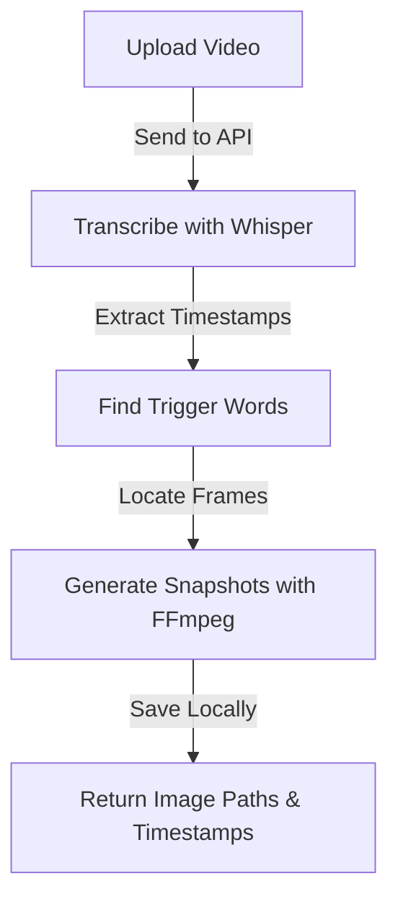

# 📌 NestJS Video Snapshot API

## 🚀 Overview
This project is a **NestJS API** that processes a video file, detects specific **trigger words** using OpenAI Whisper, and captures **exact video frames** at the timestamps where those words were spoken. The API returns an array of **image paths with timestamps**.

## 🛠 How It Works
1. **Upload a video** via an API endpoint.
2. **Transcribe the audio** using OpenAI Whisper.
3. **Extract timestamps** for the specified trigger words.
4. **Generate snapshots** using FFmpeg at the exact timestamps.
5. **Return the local file paths** of the snapshots.




## 📦 Installation
```sh
# Clone the repository
git clone <repo-url>
cd <repo-folder>

# Install dependencies
npm install

# Install FFmpeg (Required for snapshot extraction)
# Mac (using brew)
brew install ffmpeg
[ffmpeg install info](https://phoenixnap.com/kb/ffmpeg-mac)

# Ubuntu / Debian
sudo apt update && sudo apt install ffmpeg
```

## 🔥 Running the API
```sh
npm run start
```

## 📡 API Endpoints
### 1️⃣ Upload & Process Video
**Endpoint:** `POST /video/process`

**Form Data:**
- `file`: Video file (MP4, MOV, etc.)
- `triggerWords`: Array of words (e.g., `["hello", "world"]`)

**Response Example:**
```json
{
  "snapshots": [
    { "time": 5.32, "imagePath": "./snapshots/snapshot_1.jpg" },
    { "time": 12.45, "imagePath": "./snapshots/snapshot_2.jpg" }
  ]
}
```

## 💰 Whisper Pricing & Limitations
- OpenAI Whisper API has a **cost per minute** of audio processed (0,006$ per minute, need to check additionally). [Whisper API Pricing](https://openai.com/pricing)
- File uploads are currently limited to 25 MB and the following input file types are supported: mp3, mp4, mpeg, mpga, m4a, wav, and webm.
- More details about limitations can be found in OpenAI's documentation: [Whisper API Docs](https://platform.openai.com/docs/guides/speech-to-text)

## 📌 Next Steps
- Integrate **AWS S3** for cloud storage of snapshots.

